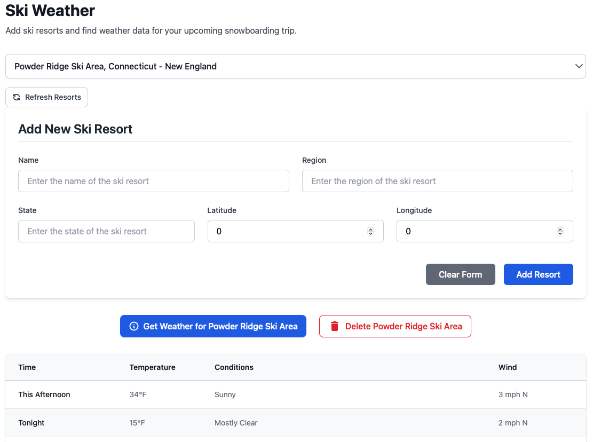

# Ski Weather App

A simple web application built with Cursor AI that allows users to track ski resorts and fetch their weather data using the weather.gov API. Users can add/remove ski resorts and view detailed weather information for each location.

## Features

- Add and remove ski resort locations
- Fetch real-time weather data from [weather.gov](https://www.weather.gov/documentation/services-web-api)
- Clean, responsive UI built with React and Tailwind CSS
- Python/Flask backend with dependency injection

Note: This is a simple application and does not have a production-ready backend and is not intended to be used in production. The data layer is persistent in the accompanying CSV file. Lighter weight data layer is used for simplicity than a full database :)

## Tech Stack

### Frontend

- React + TypeScript
- Tailwind CSS
- Vite

### Backend

- Python
- Flask
- Flask-CORS
- Inject (for dependency injection)

## Getting Started

### Prerequisites

- Python 3.8+
- Node.js 16+
- npm or yarn
- pipenv

### useful version management tools

- pyenv
- nvm

### Backend Setup

1. Navigate to the backend directory:
2. Install dependencies: `pipenv install --dev`
3. The backend will be available at `http://127.0.0.1:5000`

### Frontend Setup

1. Navigate to the frontend directory:
2. Install dependencies: `npm install`

### Running the application

1. Start the backend: `pipenv run flask run`
2. Start the frontend: `npm run start`
3. The application will be available at `http://localhost:3000`

### Stopping the application

1. Stop the backend: `Ctrl+C`
2. Stop the frontend: `Ctrl+C`

### Expected UI View

